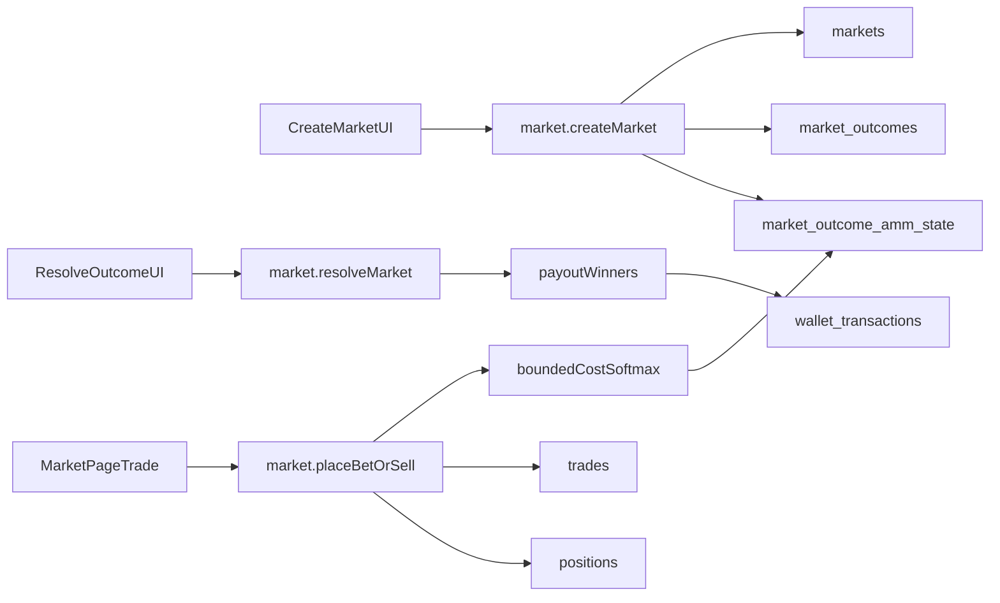

# Multi-Outcome Markets Migration Plan

## Goal

Enable creating and trading markets with many answer options (plus optional icon per option) while preserving existing YES/NO behavior and data.

## Architecture Strategy

- Keep legacy binary markets working **without data rewrite**.
- Add new normalized tables for outcomes and AMM state per outcome.
- Introduce a `market_type` switch (`binary` | `multi_choice`) and route logic by type.
- Scope this migration to **VCOIN/off-chain only**; leave on-chain USDC flow unchanged.

## DB Migration (Backward-Compatible)

- Add migration in `[supabase/migrations](supabase/migrations)`:
  - Add `markets.market_type text not null default 'binary'` (with check for allowed values).
  - Add `market_outcomes` table:
    - `id uuid pk`, `market_id uuid fk`, `slug text`, `title text`, `icon_url text null`, `sort_order int`, `is_active bool`, unique `(market_id, slug)`.
  - Add `market_outcome_amm_state` table:
    - `market_id uuid fk`, `outcome_id uuid fk`, `q numeric not null default 0`, `last_price numeric not null default 1.0/num_outcomes`, `updated_at`.
    - Unique `(market_id, outcome_id)`.
  - Add indexes for `(market_id, sort_order)` and `(market_id)` lookup paths.
- Keep existing `outcome_side`, `market_amm_state`, `positions.outcome`, `trades.outcome` unchanged for legacy binary markets.
- Add optional nullable `outcome_id uuid` to `positions` and `trades` for multi-choice rows (plus FK to `market_outcomes.id`).
- Keep old rows valid with null `outcome_id` and existing enum fields.

## Pricing + AMM Generalization (N Outcomes)

- Add generalized bounded-cost helper in `[src/server/trpc/helpers/pricing.ts](src/server/trpc/helpers/pricing.ts)`:
  - For outcome vector `q_i`, define logits `z_i = k*q_i/b`.
  - Probabilities via stable softmax: `p_i = exp(z_i - maxZ)/sum_j exp(z_j - maxZ)`.
  - Price in VCOIN/USDC display: `price_i = p_i` (e.g. `0.4 => $0.40`).
  - Cost function as bounded/log-sum-exp variant so `sum(p_i)=1` and each `p_i` in `(0,1)`.
- Keep current binary helper paths intact for `market_type='binary'`.
- Implement shared buy/sell quote + execution utilities for both types.

## Server API + RPC Changes

- Update `[src/server/trpc/routers/market.ts](src/server/trpc/routers/market.ts)`:
  - Extend `createMarket` input/output to accept:
    - `marketType` and `options[]` (`title`, optional `iconUrl`, `sortOrder`).
  - Keep binary create path defaulting to YES/NO outcomes.
  - Extend market payload to return `options[]` and per-option prices for multi-choice.
  - Extend trade endpoints to accept `outcomeId` for multi-choice while still accepting YES/NO for binary.
  - Resolve endpoint for multi-choice with single winner (`winningOutcomeId`).
- SQL function strategy:
  - Preserve current `[db/functions/place_bet_tx.sql](db/functions/place_bet_tx.sql)` and existing migration-backed RPCs for binary.
  - Add new multi-choice RPC functions (buy/sell/resolve) operating on `market_outcome_amm_state` + `outcome_id` in new migration SQL.
  - Dispatch by `market_type` in router to avoid risky rewrite of legacy SQL.

## UI Changes (Existing Style)

- Update `[components/AdminMarketModal.tsx](components/AdminMarketModal.tsx)`:
  - Add market type selector (`binary` / `multi_choice`).
  - For `multi_choice`, dynamic option builder (add/remove/reorder minimally), each option with title + optional icon upload.
  - Reuse image upload style and call existing upload endpoint for option icons.
- Add/extend upload route for outcome icons in `[app/api/market-image/upload/route.ts](app/api/market-image/upload/route.ts)` (reuse same bucket + validation).
- Update display/trading components to render multi-option chips/cards with icon + probability/price:
  - `[components/MarketCard.tsx](components/MarketCard.tsx)`
  - `[components/MarketFeedItem.tsx](components/MarketFeedItem.tsx)`
  - `[components/MarketPage.tsx](components/MarketPage.tsx)`
  - `[components/BetConfirmModal.tsx](components/BetConfirmModal.tsx)`
- Keep binary UI unchanged for old markets.

## Type + Validation Updates

- Extend shared types in `[types.ts](types.ts)` for market type, outcome objects, and outcomeId-based trades.
- Update Zod schemas that currently hardcode YES/NO:
  - `[src/schemas/portfolio.ts](src/schemas/portfolio.ts)`
  - `[src/schemas/marketInsights.ts](src/schemas/marketInsights.ts)`
  - any list/detail parsers in `[app/page.tsx](app/page.tsx)`.

## Compatibility + Safety Rules

- Default behavior: if `market_type` missing/legacy row, treat as `binary`.
- Do not mutate existing YES/NO records.
- Add constraints to prevent invalid multi-choice markets:
  - minimum 2 options,
  - unique option titles/slugs per market,
  - non-empty text,
  - price/probability finite and normalized.
- Ensure all SQL functions keep `security definer`, strict auth checks, and market state/expiry checks.

## Test/Verification Plan

- Migration verification:
  - Existing binary markets list/detail/trade/resolve unchanged.
  - New multi-choice markets can be created, traded, resolved.
- Pricing verification:
  - `sum(probabilities) == 1` (within epsilon), each `0 < p_i < 1`.
  - displayed price equals probability.
- UI verification:
  - Option icons upload + render in cards and market page.
  - Create flow validation for malformed options.
- Regression checks in `[app/page.tsx](app/page.tsx)` and `[src/server/trpc/routers/market.ts](src/server/trpc/routers/market.ts)` for binary paths.

