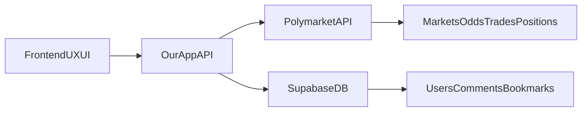

# Polymarket-Only Wrapper Migration

## Goal

Keep your current product shell (design, UI/UX, profiles, comments, bookmarks), but move all market and money operations to Polymarket API.

- Keep: auth, user profiles, comments, bookmarks, frontend design/flows.
- Remove: local market creation/edit/delete, local betting/selling/claiming/resolution, local wallet balances/positions/trades as source of truth.
- Replace with: Polymarket-backed market feed/details/trading state endpoints.

## New Data Boundaries




- `Supabase`: social + app metadata only.
- `Polymarket`: markets, prices, liquidity, positions, trading actions, settlement outcomes.

## Codebase Changes

### 1) Remove local market/trading business logic from backend

- Replace the current heavy market router in `[src/server/trpc/routers/market.ts](src/server/trpc/routers/market.ts)` with Polymarket-backed read/trade facade procedures.
- Remove procedures tied to local market DB lifecycle and local settlement:
  - `createMarket`, `updateMarket`, `deleteMarket`
  - local `placeBet`/`sellPosition`/`resolveMarket`/`myPositions`/`myTrades`/`myWalletBalance` logic based on internal SQL RPCs.
- Keep/refactor social procedures to remain DB-backed where relevant:
  - comments, likes, bookmarks (adjust to Polymarket market IDs).

### 2) Introduce Polymarket integration layer

- Add a dedicated integration module (e.g., under `src/server/`) for:
  - market list/detail fetch,
  - odds/price snapshots,
  - user positions/trade history fetch (if available via chosen Polymarket APIs),
  - optional order/trade actions routing.
- Update `[src/server/trpc/router.ts](src/server/trpc/router.ts)` to expose only wrapper-safe market API surface.

### 3) Frontend: keep design, swap data/actions source

- Update `[app/page.tsx](app/page.tsx)` to remove calls to deleted mutations and wire to new Polymarket-backed procedures.
- Remove create/edit/delete entry points and related state wiring in home page flow.
- Keep visual components and page structure; adapt only data contracts where needed.

### 4) Remove market-creation UI from app shell

- Remove or decommission:
  - `[components/AdminMarketModal.tsx](components/AdminMarketModal.tsx)`
  - any create/edit/delete controls in `[components/MarketPage.tsx](components/MarketPage.tsx)`
- Keep all existing styling/layout patterns for market cards and pages.

### 5) Social DB model migration (fresh Supabase DB)

- Since DB is new, replace old migration history with a minimal social schema set:
  - users/profile fields,
  - comments + comment likes,
  - bookmarks,
  - optional mapping table if needed (`polymarket_market_id` references).
- Remove legacy market-money schema usage and associated migration files under `[supabase/migrations/](supabase/migrations/)`.
- Regenerate DB types (`src/types/database.ts`) from the new social-only schema.

### 6) Replace env template with minimal required variables

- Rewrite `[.env.example](.env.example)` to include only:
  - app/public URL variables,
  - Supabase auth/profile/social vars,
  - Telegram/auth vars if still used,
  - AI/context vars (`OPENAI_API_KEY`, `TAVILY_API_KEY` if context generation remains),
  - Polymarket API configuration vars.
- Remove Solana/Anchor/Helius/on-chain and legacy deploy env entries.

## Separate Command: create a new Supabase project/database

Use a standalone command (template):

```bash
supabase projects create "prediction-market-ru-v2" --org-id <ORG_ID> --region <REGION> --db-password "<STRONG_DB_PASSWORD>"
```

Then link locally and push the new minimal schema/migrations.

## High-Risk Compatibility Notes

- Current metadata/share pages query `markets` directly in Supabase:
  - `[app/market/[marketId]/page.tsx](app/market/[marketId]/page.tsx)`
  - `[app/share/market/[marketId]/page.tsx](app/share/market/[marketId]/page.tsx)`
- These must be switched to Polymarket-backed fetch path (or cached proxy) to avoid broken OG metadata.

## Validation Checklist

- App runs with no local market-creation controls.
- Market feed/details render from Polymarket data only.
- Trading/positions/market outcomes come from Polymarket-backed endpoints only.
- Comments/bookmarks/profiles continue to work with new Supabase schema.
- `.env.example` contains no legacy Solana/on-chain variables.
- Home page and market page maintain existing design/UX behavior.

